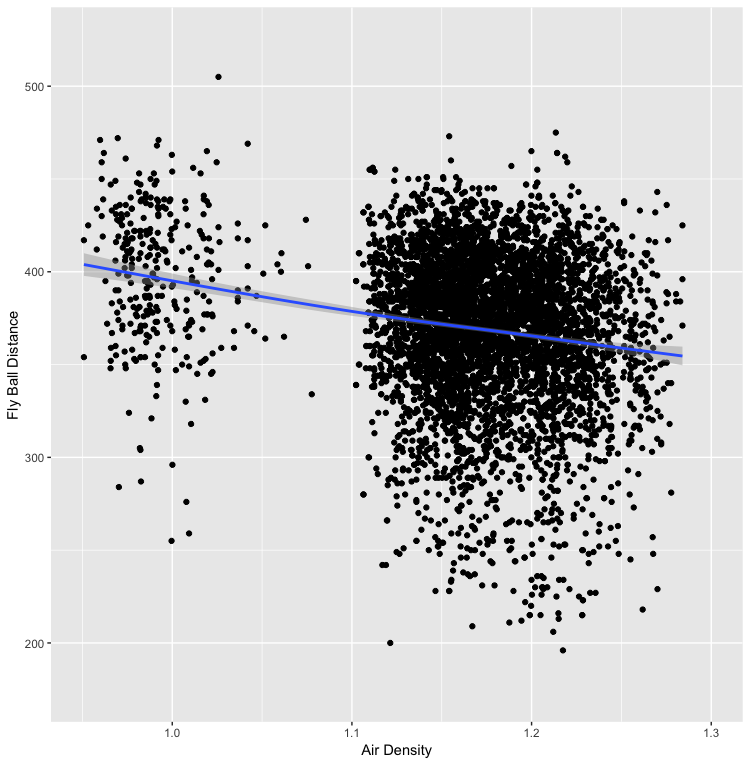
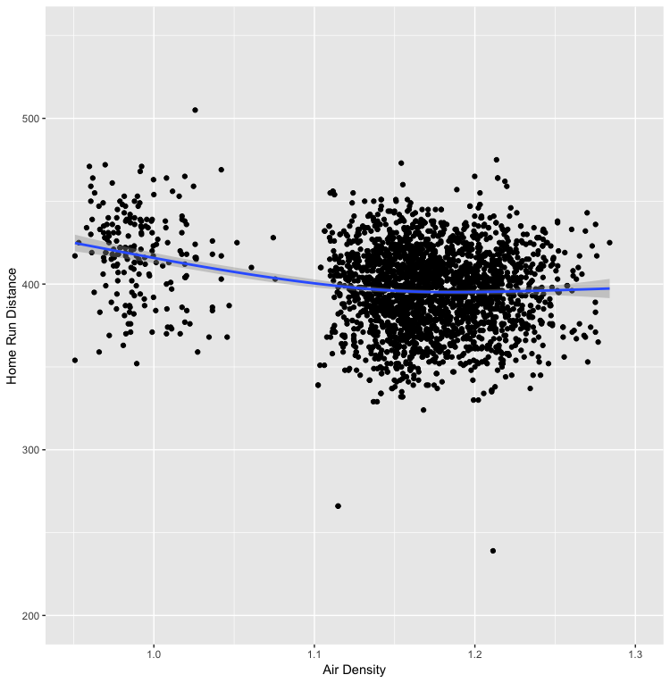
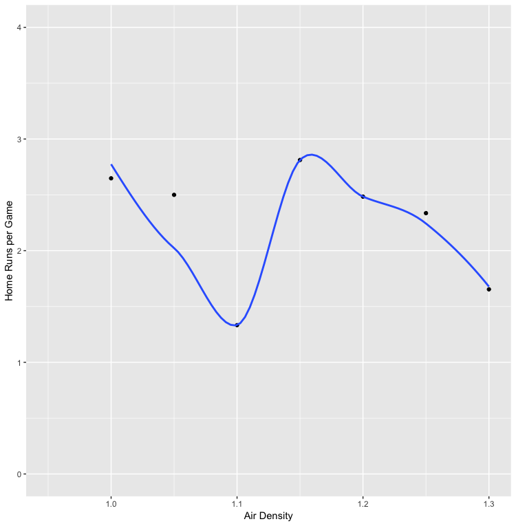
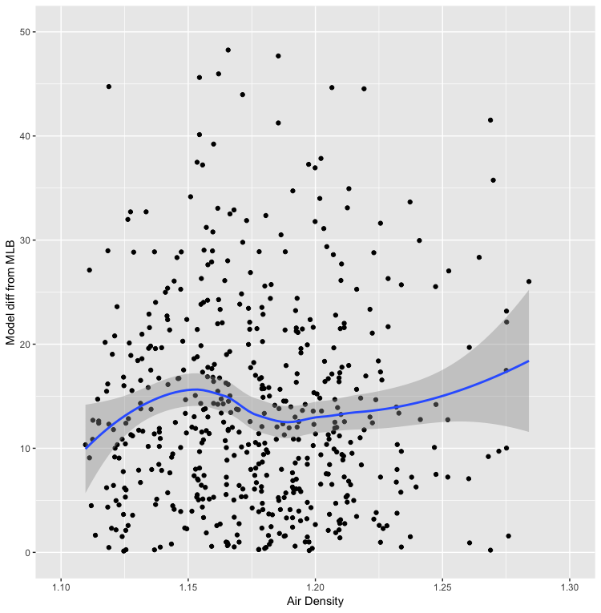
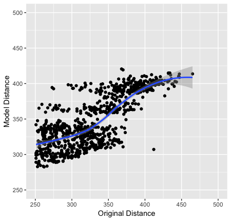

The angle and velocity of a ball leaving the bat, in conjunction with the weather, determines how far it will fly.  Our analysis of air density showed that the average distance of a hard-hit fly ball decreased as air density increased.  We expected this outcome, as it has been both modeled [@cross2011pbs], [@bahill2019sb] and it has been previously analyzed [@constancio2006te], [@kagan2017mlfb].

We defined a hard-hit fly ball as one that left the bat with a velocity of 95 miles per hour or greater and was marked as a fly ball by the Baseball Savant system.  Our decision to use fly balls in this analysis came from the feeling that the MLB-provided hit distance data showed the true distance traveled by the ball on each batting event.  Consider the case in which a batter hits a line drive and the left fielder catches it on a run with his glove over his head.  In this case, the ball travels less distance than it would have if there were no fielder.  A fly ball is much more likely to be caught (if it were to be caught) somewhere near where it would have landed naturally.  We decided to look at hard-hit balls because we felt as though the quality of the contact with the bat must be high to have such a high velocity and that limiting our analysis to these kind of hits will limit the number of other unknown and unstudied factors that may reduce the accuracy of the analysis.

Including the fly balls in Colorado, the average distance decreased by nearly 60 feet as air density increased from 0.95 to 1.25.  Excluding Colorado, the average distance decreased by around 30 feet as air density increased from 1.1 to 1.25.  This is in line with previous results and expectations.



We similarly compared the average distance of home runs.  Including Colorado, we see that the average distance decreases by around 25 feet as air density increased from 0.95 to 1.25.  However, excluding Colorado, we see that the average distance of a home run is nearly unchanged as air density increased from 1.1 to 1.25.



Both charts show very high variability in distance at any air density.  As mentioned earlier, the angle and the velocity are also factors in the distance a ball will travel.  Indeed, this data implies that the angle and velocity are far greater factors in the distance and that the air density does not greatly influence the ability of a player to make "good" contact with a ball, leading to fly balls that travel a long distance.

The relatively unchanged distance of home runs is unexpected but explainable.  Except in the rare instance of an inside-the-park home run, the ball either clears the outfield wall or is not a home run.  The wall does not move, no matter the air density.  As the air density increases, some number of batted balls that otherwise would have been home runs fall just a little short of the outfield wall and are home runs.

Because fly balls that fall a little short are not home runs, we would expect that the average number of home runs per game should decrease as air density increases.  Our analysis shows that this is roughly true, though we have too few games at various air densities to demonstrate such a phenomenon.  As can be seen in the chart, the average number of home runs per game at an air density of 1.1 is very low.  However, there are so few games in our study that were played at an air density of 1.1 that these games have an outsized effect.  Nevertheless, we can see that there is indeed a decline in the average number of home runs per game as the air density increases.



The Baseball Savant data provided by Major League Baseball defines the fly ball distance as an estimated value.  The actual value should be considered to be within 30 feet of the estimate [@bahill2019sb, pg 209].  To analyze the MLB-provided estimate, we built a linear model in R using 3/5 of the fly balls.  Our model used the angle, velocity and air density as well as the _launch_speed_angle_ value as factors to determine distance travelled.  The _launch_speed_angle_ value is provided by MLB as an indicator of the quality of contact made:
```
1 - Weak
2 - Topped
3 - Under
4 - Flare/Burner
5 - Solid Contact
6 - Barrel
```
With the remaining 2/5 of the data, we predicted the distance a fly ball should travel and recorded the absolute value of the difference between the prediction and estimation.  Our analysis showed that the vast majority of fly ball predictions were in fact within 30 feet of the MLB estimate.  However, as air density increased from 1.15 to 1.25, the average difference increased from around 10 feet to almost 20 feet.  We do not have an explanation for this, but it is possible that the MLB algorithm is tuned for a specific air density or that it does not consider air density at all.  Further analysis may prove useful.



Given this model, we can make predictions about batted balls as if they had occured in a different stadium and/or at a different time.  To do this, we keep the information about the the angle, velocity and quality of contact for a set of batted balls and substitute the weather information that corresponds to the desired location and time.  We can then compare the original distance traveled with the new predicted distance traveled to see how the two values differ.  We chose to model what it would look like if all 2018 home games in Boston had been played at Coors Field on June 10, 2018 (all else held equal).  The air density on June 10, 2018 was extremely low (which was why we chose it) and we limited the batted balls to those which had a reported distance of greater than 250 feet and a launch angle greater than 0.  Our analysis showed that between 250 and 350 feet, the predicted distance traveled increased but that at reported distances of greater than 350 feet, our model did not show much if any increase.  This is not at all what we had expected and points to deficiencies in the model and/or data.

