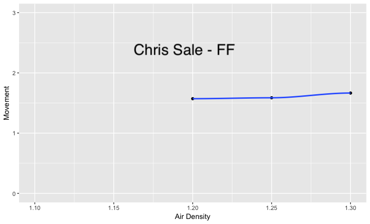
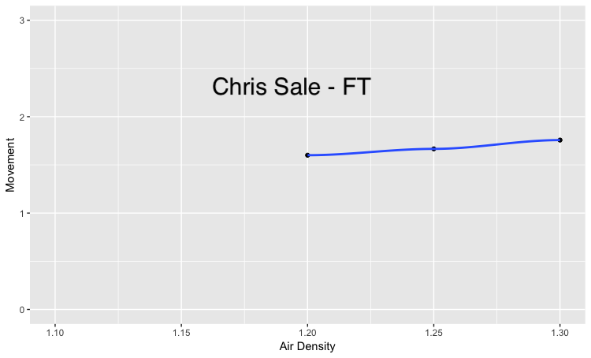
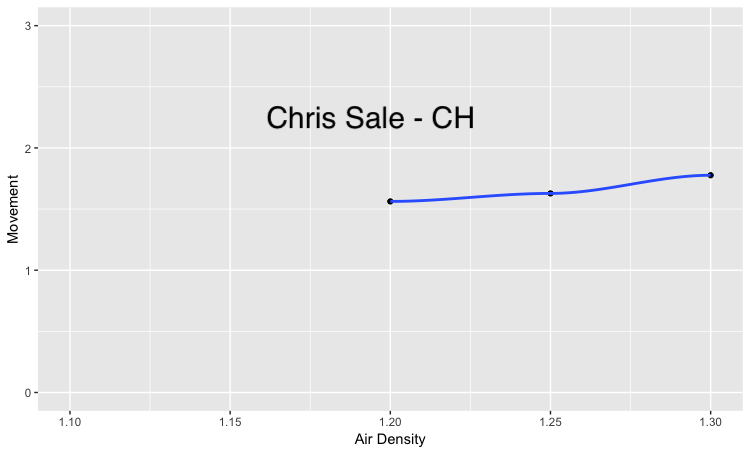
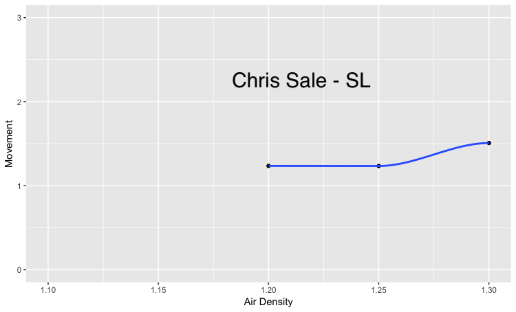
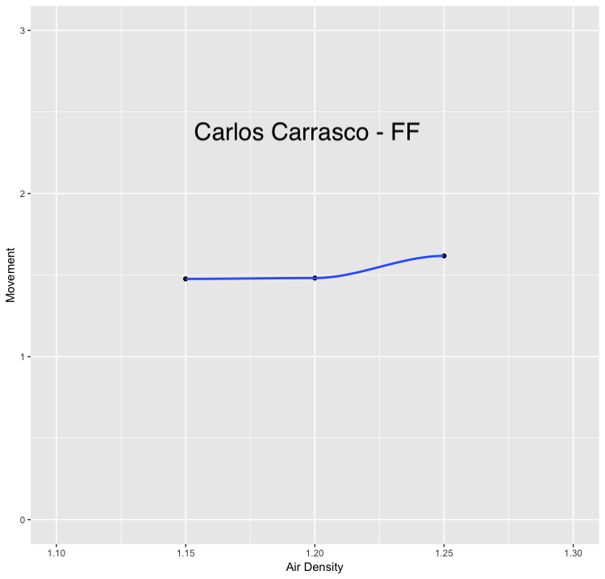
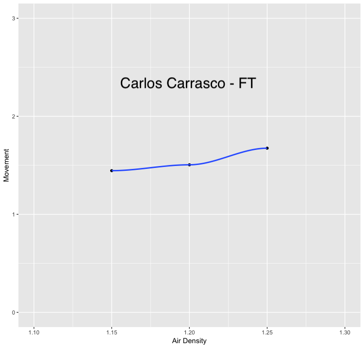
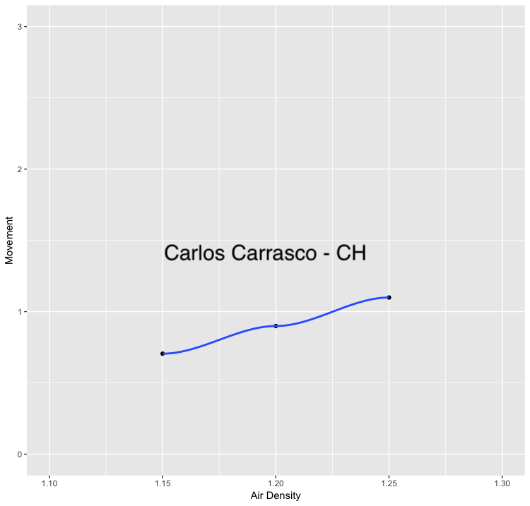
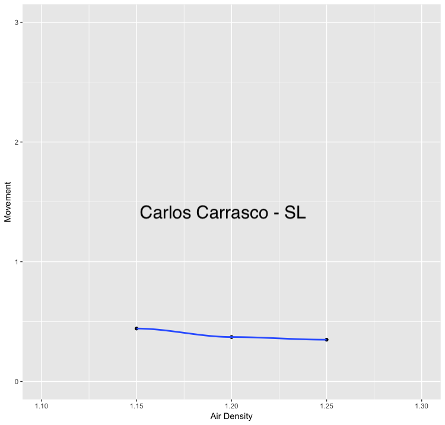

Our analysis of pitch movement showed that overall, pitches move more as air density increases.  The amount of movement increase is different for each type of pitch.  The amount of rotation on each kind of pitch is different, so this makes sense.

When looking at individual pitchers, we see that the movement change is highly individualize and that factors such as grip and talent play a role.  For example, we found that Chris Sale sees almost no change at all in the movement of his 4-seam fast ball, while his slider and change up have the largest increase in movement.

On the other hand, Carlos Carrasco's slider appears to have reduced movement as air density increases.  His change up movement increases quite a bit more than Chris Sale's, as does his 2-seam fastball.  His 4-seam fastball has a very similar change in movement to Chris Sale.

Because the change in pitch movement for each pitch type is highly individualized, it is possible that further study can show that individual pitchers have different pitches that are most and least effective based on the weather, and that such knowledge could be useful for both pitchers and batters.
