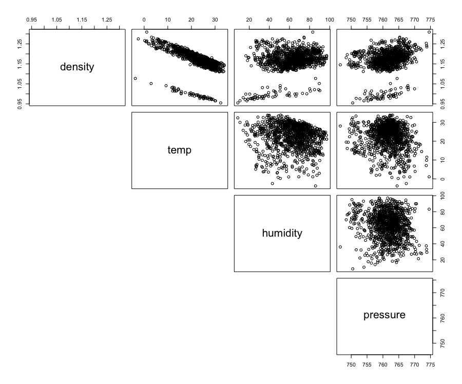
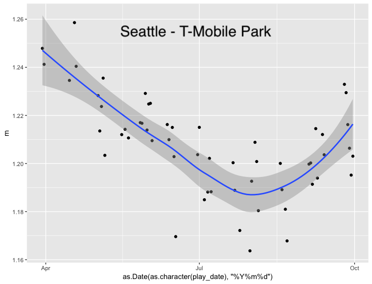
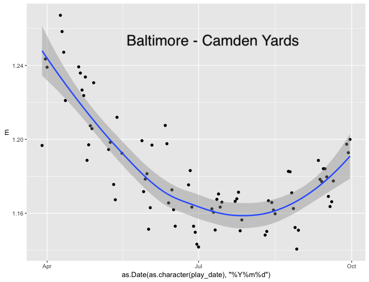
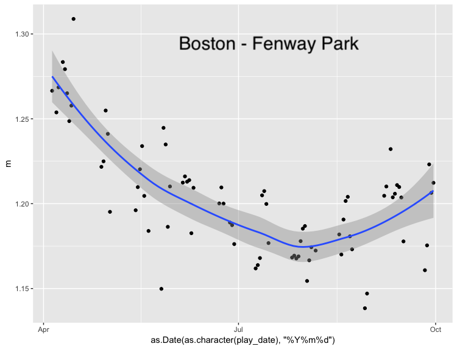
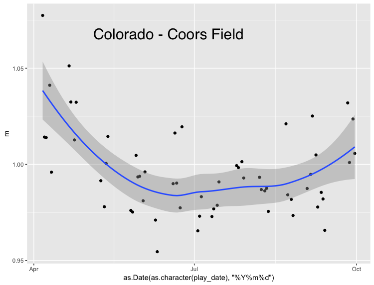
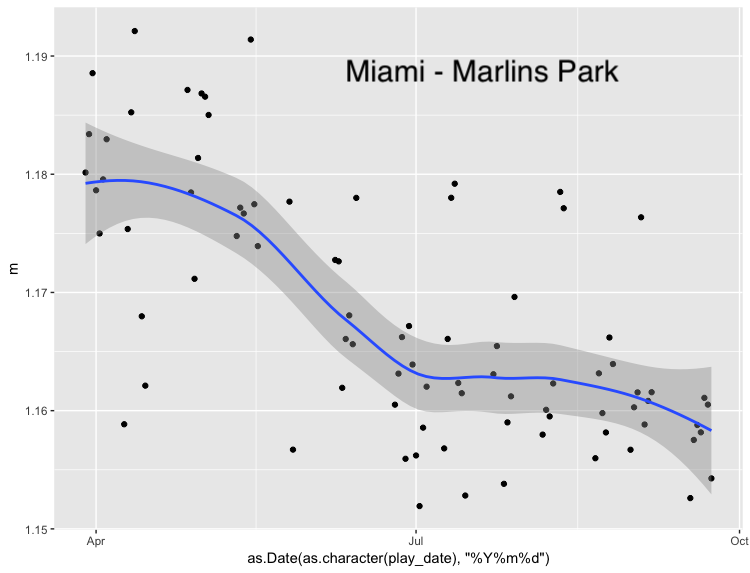

Altitude has the greatest effect on air density; traveling from sea level to 5200 feet in altitude (Coors Field) increases air density by approximately 18%.  Increasing temperature from 70 degrees Fahrenheit to 100 degrees Fahrenheit increases air density by approximately 8%.  Increasing the relative humidity from 10% to 90% increases air density by approximately 3%, and increasing barometric pressure from 29.3 inHg to 30.5 inHg decreases air density by approximately 4% [@bahill2019sb, pg 185].

Our analysis of actual data from weather stations has shown that temperature and humidity are weakly correlated, with humidity tending to decrease as temperature decreases.  However, we see that barometric pressure does not seem to be correlated at all with either temperature or humidity.

The ideal formula for determining air density will take all variables as inputs to generate the most accurate value for air density.  However, given that altitude and temperature have the greatest effect on air density and that altitude is a constant value at any stadium and temperature is one of the easiest weather measurements to obtain, a predictive model using date, time, temperature and stadium can be built using historical data (including humidity and air pressure).  Such a model is likely to be accurate to within 5% of actual air density.

We examined the mean intragame air density at a number of stadiums and found that the air density is typically high at the beginning of the season and drops into summer.  The air density then rises again in the fall.  In St. Louis, we found that the trough appears in late June and then increases for the rest of the season.

In Seattle, Baltimore and Boston, the trough was in August and had a pronounced increase into the fall.

At Coors Field in Denver, the early-season drop and the late-season increase in air density is less pronounced as in other locations.  The air density is far more consistant while still showing the same general shape as other stadiums throughout the season.

Miami presents a different shape altogether.  The air density starts higher in the spring, as in other stadiums.  However, the air density drops through the entire season instad of having a trough and then an increase.  Variability in mean intragame air density is very high.  The weather comes from a weather station outside the stadium, but inside the stadium it may be a different story.  Marlins Park has a retractable roof and when it is closed, the air density is likely to have very low variability.

