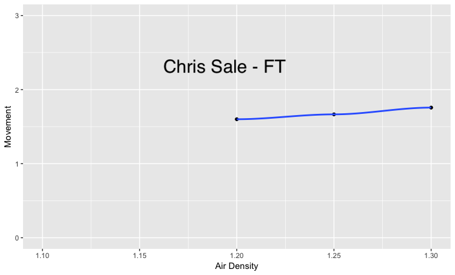
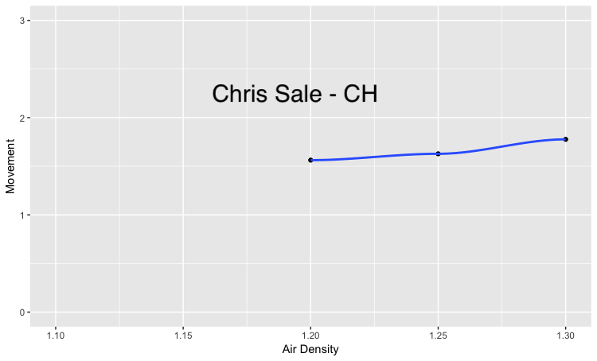
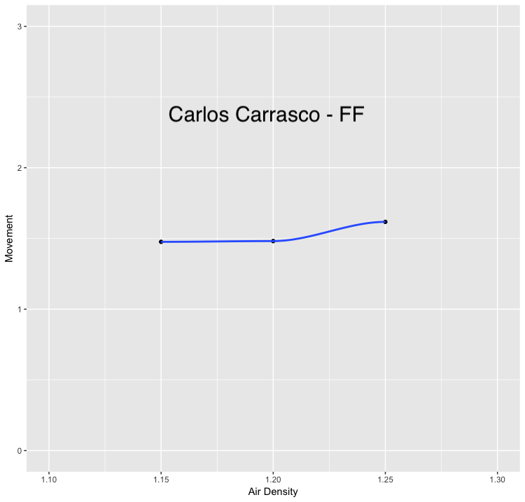
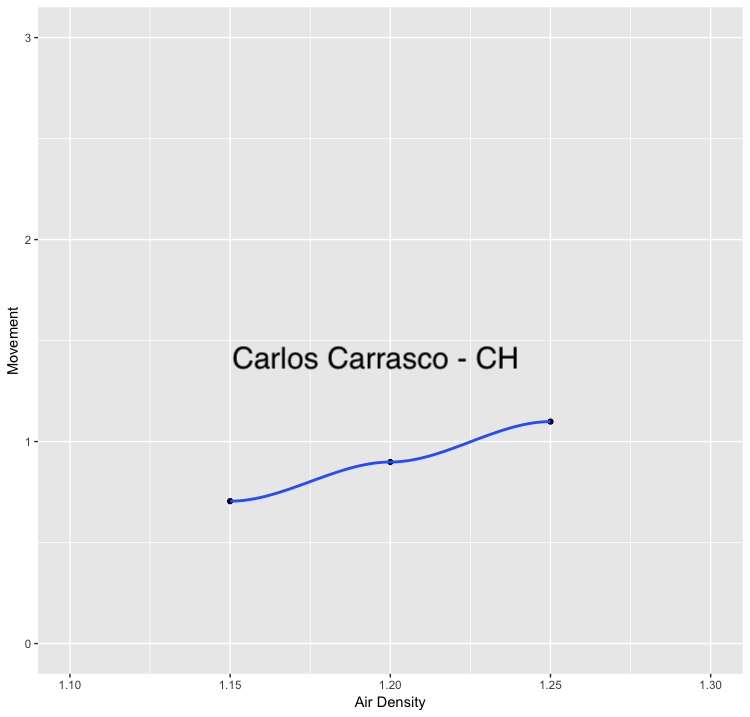

# Introduction

Baseball is a sport traditionally played outdoors. With a long season, the players inevitably face a wide variety of weather.  Players have passed down tales of home runs that fall short due to temperature [@kagan2017mlfb] and scientists have studied the variations in laboratory settings [@cross2011pbs, pp 43-44] [@bahill2019sb, pp 180-188].  We know now that air density affects the flight of the ball and that temperature, humidity and air pressure all play a role in increasing or decreasing the air density.  Using air density, we can model baseball flight using formulas that have been derived for that purpose.

The differing weather that players face should cause performance to vary, and indeed analysis of available baseball data has shown that observed differences in the flight of the ball can be correlated with measured weather data [@kagan2017mlfb].  This analysis has shown that the quality of the weather data is important for demonstrating the statistical significance of these differences.  Weather data has typically been available from airports that are near the baseball stadiums, and when the airports are closer, the results of the analysis is of higher quality [@kagan2017mlfb, pg 6].  Unfortunately, few baseball stadiums are very close to commercial airports.  The quality of the weather data used thus far is much worse than the quality of the baseball data.

In addition to the effect of weather on a baseball in flight, the human body is affected by the weather.  Analysis has shown that temperature affects players differently based on how active they are during the time that their team is on defense [@schifman2016cwpp].  Intuitively, this make sense; players that must be active on defense are building up body heat and are keeping their muscles loose.  Interestingly as well, pitchers report that it is harder to grip the ball when it is cold [@constancio2006te, pg 2].

Previous analysis has relied upon weather data that in many cases is not ideal.  We have found ways to identify weather data from weather stations that are closer to baseball stadiums.  It has not been possible to access all of this data, but in the cases in which it was possible, this data allows us to better understand the correlations between weather and performance.  We are also able to generate a model that predicts the performance/distance of a batted ball as if it were to have happened in another stadium at any specific time (assuming we have weather data for that time).

# MLB Baseball Savant

The Baseball Savant site (https://baseballsavant.mlb.com) provides detailed pitch-by-pitch data directly from Major League Baseball.  This data is generated using a suite of instruments installed in every major league stadium.  Gathering data for research use can be done using the search function (https://baseballsavant.mlb.com/statcast_search).  The amount of data that can be retrieved in a single query is limited, so the retrieval of an entire season can be done by querying for each team individually and then selecting the "download CSV" option.

The _sv_id_ column in the data gives an encoded date and time for each pitch.  For example, an _sv_id_ of `181001_195541` refers to a pitch that occurred on October 1, 2018 at 19:55:41.  The data does not distinguish whether that refers to local time, eastern time, or UTC time.  To determine the value, we examined all Savant records in which _sv_id_ was populated and the _pitch_number_ and _at_bat_number_ were both 1.  This indicated the time of the first pitch of each game.  Using Baseball Reference (https://baseball-reference.com) we can find the start time of each game and compare to the time portion of _sv_id_.  The April 10, 2018 game between the Cubs and Pirates at Wrigley Field had a published start time of 1:20 PM Central (2:20 PM Eastern).  The _sv_id_ for the first pitch was `180410_182326` indicating that the first pitch was at 6:23 PM.  Chicago is 5 hours behind UTC time, so 1:23 PM in Chicago corresponds with 6:23 PM UTC.  This shows that the time portion of the _sv_id_ field is listed as UTC time.

In addition to the _sv_id_ column, the _game_date_ column contains the date of the game and the _game_pk_ column is a primary key to distinguish one game from another in the case of double-headers.  The _at_bat_number_ identifies the at bat and the _pitch_number_ identifies the pitch within the at bat.  Using this information, we can construct a timeline of all the at bats in a particular baseball game.  This is necessary because in the Baseball Savant data, the _sv_id_ field is blank for more than 50% of the at bats.  In almost all of these instances, the _sv_id_ is blank for the entire game.

# MLB GameDay

MLB also makes data available to its GameDay application using a hierarchical website (http://gd2.mlb.com/content/game/mlb) containing many XML files.  For any particular game, there is a file titled _inning_all.xml_ that contains a sequential list of all at bats during the game.  The structure of the XML file allows us to determine the at bat number and the pitch number within the at bat.  Each pitch object in the file contains an _sv_id_ and a _start_tfs_zulu_ attribute.  This allowed us to construct a parallel timeline for each baseball game and to join it to the Baseball Savant data.  While the _sv_id_ and _start_tfs_zulu_ attributes were not 100% populated, once joined with the Baseball Savant data we had an accurate date and time for more than 99% of all pitches in the 2018 baseball season.

# NOAA

The National Weather Service provides weather data primarily from commercial airports and military bases.  Data for each weather station is contained in a single file for each year.  The longitude and latitude of the station is provided and we built a process identify the distance to the nearest baseball stadium.  An example is shown for a few stadiums.  The file name, the station name, and the distance to the stadium in miles is provided:

```
BAL 
72406093721.csv|BALTIMORE WASHINGTON INTERNATIONAL AIRPORT|8.346815
74594493784.csv|MARYLAND SCIENCE CENTER|0.591354
99729699999.csv|BALTIMORE MD|2.928523
99730299999.csv|FRANCIS SCOTT KEY BR|7.013149
BOS 
72509014739.csv|BOSTON|4.594463
74490714753.csv|BLUE HILL LCD|9.311953
99497199999.csv|BOSTON|2.441077
NYY 
72055399999.csv|PORT AUTH DOWNTN MANHATTAN WALL ST HEL|9.852684
72502594741.csv|TETERBORO AIRPORT|7.210130
72503014732.csv|LA GUARDIA AIRPORT|4.224295
72505394728.csv|NY CITY CENTRAL PARK|4.133639
99727199999.csv|THE BATTERY|9.983033
99728099999.csv|KINGS POINT|8.431884
TOR 
71265099999.csv|TORONTO CITY CENTRE|1.734810
71508099999.csv|TORONTO CITY ONT|1.830597
CHA 
72534014819.csv|CHICAGO MIDWAY AIRPORT|6.814561
99725599999.csv|9087044 CALUMET IL|8.443858
99849999999.csv|NORTHERLY ISLAND|2.208897
CLE 
72524504853.csv|CLEVELAND BURKE LAKEFRONT AIRPORT|1.501178
99769299999.csv|CLEVELAND|3.712512
```

The file contains many types of climate reports for a particular weather station.  We found that the FM-15 report type (METAR Aviation routine weather report) contained all needed information, including station elevation, wind speed and direction, temperature, sea level corrected air pressure and dew point (we can determine humidity with these variables).  Each individual measurement includes a quality code:

```
0 = Passed gross limits check
1 = Passed all quality control checks
2 = Suspect
3 = Erroneous
4 = Passed gross limits check, data originate from an NCEI data source
5 = Passed all quality control checks, data originate from an NCEI data source
6 = Suspect, data originate from an NCEI data source
7 = Erroneous, data originate from an NCEI data source
9 = Passed gross limits check if element is present
```

# Weather Underground

Weather Underground is a site (https://www.wunderground.com) that contains data for a number of "official" weather stations as well as ~250,000 personal weather stations from around the globe.  Each weather station has a unique identifying code in the Weather Underground system.  For example, weather station KMABROOK5 is at the corner of Beacon and Carlton St just a few blocks west of Fenway Park.  Weather station KMABOSTO55 is listed as at Fenway Park itself, but unfortunately attempts to query the Weather Underground API for data from this station was unsuccessful.  When viewing the dashboard for a weather station (https://www.wunderground.com/dashboard/pws/KMABROOK5), all data for that weather station for a particular day is loaded.  By looking at the format of the request made by the web browser, we can see how to query any weather station for any day.  The data is returned as a set of observations in the JSON format.  We have developed a tool that "flattens" these observations into a CSV format suitable for use in R.  An example of the raw observation data provided by Weather Underground is shown below:
```json
{
  "stationID":"KCASANFR1213",
  "tz":"America/Los_Angeles",
  "obsTimeUtc":"2018-04-03T07:02:00Z",
  "obsTimeLocal":"2018-04-03 00:02:00",
  "epoch":1522738920000,
  "lat":37.771065, "lon":-122.38821,
  "solarRadiationHigh":0,
  "uvHigh":0,
  "winddirAvg":244,
  "humidityHigh":77, "humidityLow":77, "humidityAvg":77,
  "qcStatus":-1,
  "imperial":{
    "tempHigh":53, "tempLow":53, "tempAvg":53,
    "windspeedHigh":4, "windspeedLow":4, "windspeedAvg":4,
    "windgustHigh":6, "windgustLow":6, "windgustAvg":6,
    "dewptHigh":46, "dewptLow":46, "dewptAvg":46,
    "windchillHigh":null, "windchillLow":null, "windchillAvg":null,
    "heatindexHigh":null, "heatindexLow":null, "heatindexAvg":null,
    "pressureMax":29.58, "pressureMin":29.58, "pressureTrend":0.00,
    "precipRate":0.00, "precipTotal":0.00
  }
}
```

Each weather station reports data to Weather Underground periodically.  However, each weather station is different in frequency and time between observations.  For many of the weather variables, the observation contains the minimum, maximum and average value of that variable over the time period since the prior observation.  For this reason, we have to use the average value of that variable as our data point for the range of time between observations.  The barometric pressure readings, on the other hand, only show a high and low value as well as the trend, but the trend is frequently empty.  We have decided to average the high and low values and use that.

Unfortunately, the barometric pressure is further complicated by the fact that there are multiple ways to report pressure (true pressure as observed at the station, sea level corrected pressure, or sea level corrected pressure with past readings factored in) and each station reports in one of those ways without specifying which it is reporting [@choosepws2012].  The National Weather Service reports sea level corrected pressure at airports.  By comparing the weather station value with the nearby airport value for observations at the same time, we can make an educated guess about the reporting method used by the weather station.  As the elevation of a weather station increases, the pressure decreases - about 1.1 inHG per 1000 feet [@choosepws2012].  If the simultaneous pressure reading of the weather station and the airport differs be a few hundredths (inHg), then the weather station is highly likely to be reporting the sea level corrected pressure rather than the true pressure.

# Methods

As a prerequisite to conducting analysis of the data, we must first assemble a clean data set that is properly merged and contains relevant information.  As both the Baseball Savant and the Weather Underground data include a UTC time, we can merge data using this.  The Baseball Savant data gives an exact time (to the second) while the Weather Underground data gives a time stamp that indicates the data is valid from the previous reading up to and including the time stamp.  We must process the Weather Underground data ordered by station and time, and generate an explicit time range from the implied range that comes from the observation data and the ordering of the observation data.  We must also generate a cross referencing of home team to weather station.  In the 2018 baseball season, the Baseball Savant data set includes 721,190 records and 126,283 records in which the ball was put into play.  The _sv_id_ field was empty for 392,521 of the records and for 68,878 of the records in which the ball was put into play.  This field is necessary for merging with weather data so we must generate a value to use with the missing data.  Because the weather data has an implied granularity that ranges from a few minutes all the way up to nearly an hour, we only need to get each missing _sv_id_ value correct to within a few minutes to be considered clean for merging purposes.

In both the Baseball Savant data and the Weather Underground data, we must convert the UTC information and _sv_id_ information to a common format.  In the Baseball Savant data, the _sv_id_ (a text string) of `180410_182326` is converted to an integer value of `20180410182336`.  In the Weather Underground data, the _obsTimeLocal_ (a text string) of `2018-04-03 00:02:00` is converted to an integer value of `20180403000200`.  To join a specific Baseball Savant time to a Weather Underground time range, we join the two together such that the Baseball Savant time is _greater than_ the beginning of the Weather Underground time range and is also _less than or equal to_ the end of the Weather Underground time range.  We must also cross reference the home team in the Baseball Savant data to the weather station in the Weather Underground data.  This can only be done by generating our own cross reference data table:

```json
"home_team","weather_station","elevation_ft","true_pressure"
"ARI","KAZPHOEN469",1280,"N"
"ATL","KGAATLAN378",919,"Y"
"BAL","KMDBALTI156",32,"Y"
"BOS","KMABROOK5",39,"Y"
"CHC","KILCHICA60",610,"N"
"CWS","KILCHICA600",600,"N"
"CIN","KOHCINCI398",607,"N"
"CLE","KOHCLEVE180",730,"N"
"COL","KCODENVE78",5225,"N"
```

The formula for calculating air density is described in @bahill2019sb [pp180-182] and is an input to the ball trajectory code.  The three inputs to the calculation are the temperature, the humidity level, and the true station pressure.  The cross reference data table includes both the weather station elevation and our educated guess on whether or not the station is reporting the true station pressure.  If it not, we must convert the sea level corrected pressure to true station pressure, a formula for which is also described in @bahill2019sb [pp180-182].  We implemented the formulas in R code, as shown below.

```{r eval=FALSE}
svp <- function(temp_celcius) {
  numerator = (18.687 - (temp_celcius/234.5)) * temp_celcius
  denominator = 257.14 + temp_celcius
  4.5841 * (2.71828 ^ (numerator / denominator))
}

air_pressure <- function(temp_celcius,bp_mmHg_sea_level,altitude_ft) {
  numerator = (-9.80665*0.0289644*altitude_ft*0.3048)
  denominator = (8.31447*(temp_celcius+273.15))
  bp_mmHg_sea_level * (2.71828 ^ (numerator / denominator))
}

air_density <- function(temp_celcius,air_pressure_mmHg,svp_mmHg,humidity_percent) {
  part1 = 273/(temp_celcius+273)
  part2 = 0.379 * svp_mmHg * humidity_percent / 100
  part3 = (air_pressure_mmHg - part2) / 760
  1.2929 * part1 * part3
}
```


# Weather Analysis

Altitude has the greatest effect on air density; traveling from sea level to 5200 feet in altitude (Coors Field) increases air density by approximately 18%.  Increasing temperature from 70 degrees Fahrenheit to 100 degrees Fahrenheit increases air density by approximately 8%.  Increasing the relative humidity from 10% to 90% increases air density by approximately 3%, and increasing barometric pressure from 29.3 inHg to 30.5 inHg decreases air density by approximately 4% [@bahill2019sb, pg 185].

Our analysis of actual data from weather stations has shown that temperature and humidity are weakly correlated, with humidity tending to decrease as temperature decreases.  However, we see that barometric pressure does not seem to be correlated at all with either temperature or humidity.


The ideal formula for determining air density will take all variables as inputs to generate the most accurate value for air density.  However, given that altitude and temperature have the greatest effect on air density and that altitude is a constant value at any stadium and temperature is one of the easiest weather measurements to obtain, a predictive model using date, time, temperature and stadium can be built using historical data (including humidity and air pressure).  Such a model is likely to be accurate to within 5% of actual air density.

We examined the mean intra-game air density at a number of stadiums and found that the air density is typically high at the beginning of the season and drops into summer.  The air density then rises again in the fall.  In St. Louis, we found that the trough appears in late June and then increases for the rest of the season.


In Seattle, Baltimore and Boston, the trough was in August and had a pronounced increase into the fall.


At Coors Field in Denver, the early-season drop and the late-season increase in air density is less pronounced as in other locations.  The air density is far more consistent while still showing the same general shape as other stadiums throughout the season.


Miami presents a different shape altogether.  The air density starts higher in the spring, as in other stadiums.  However, the air density drops through the entire season instead of having a trough and then an increase.  Variability in mean intra-game air density is very high.  The weather comes from a weather station outside the stadium, but inside the stadium it may be a different story.  Marlins Park has a retractable roof and when it is closed, the air density is likely to have very low variability.


# Batting Analysis

The angle and velocity of a ball leaving the bat, in conjunction with the weather, determines how far it will fly.  Our analysis of air density showed that the average distance of a hard-hit fly ball decreased as air density increased.  We expected this outcome, as it has been both modeled [@cross2011pbs], [@bahill2019sb] and it has been previously analyzed [@constancio2006te], [@kagan2017mlfb].

We defined a hard-hit fly ball as one that left the bat with a velocity of 95 miles per hour or greater and was marked as a fly ball by the Baseball Savant system.  Our decision to use fly balls in this analysis came from the feeling that the MLB-provided hit distance data showed the true distance traveled by the ball on each batting event.  Consider the case in which a batter hits a line drive and the left fielder catches it on a run with his glove over his head.  In this case, the ball travels less distance than it would have if there were no fielder.  A fly ball is much more likely to be caught (if it were to be caught) somewhere near where it would have landed naturally.  We decided to look at hard-hit balls because we felt as though the quality of the contact with the bat must be high to have such a high velocity and that limiting our analysis to these kind of hits will limit the number of other unknown and unstudied factors that may reduce the accuracy of the analysis.

Including the fly balls in Colorado, the average distance decreased by nearly 60 feet as air density increased from 0.95 to 1.25.  Excluding Colorado, the average distance decreased by around 30 feet as air density increased from 1.1 to 1.25.  This is in line with previous results and expectations.


We similarly compared the average distance of home runs.  Including Colorado, we see that the average distance decreases by around 25 feet as air density increased from 0.95 to 1.25.  However, excluding Colorado, we see that the average distance of a home run is nearly unchanged as air density increased from 1.1 to 1.25.


Both charts show very high variability in distance at any air density.  As mentioned earlier, the angle and the velocity are also factors in the distance a ball will travel.  Indeed, this data implies that the angle and velocity are far greater factors in the distance and that the air density does not greatly influence the ability of a player to make "good" contact with a ball, leading to fly balls that travel a long distance.

The relatively unchanged distance of home runs is unexpected but explainable.  Except in the rare instance of an inside-the-park home run, the ball either clears the outfield wall or is not a home run.  The wall does not move, no matter the air density.  As the air density increases, some number of batted balls that otherwise would have been home runs fall just a little short of the outfield wall and are home runs.

Because fly balls that fall a little short are not home runs, we would expect that the average number of home runs per game should decrease as air density increases.  Our analysis shows that this is roughly true, though we have too few games at various air densities to demonstrate such a phenomenon.  As can be seen in the chart, the average number of home runs per game at an air density of 1.1 is very low.  However, there are so few games in our study that were played at an air density of 1.1 that these games have an outsized effect.  Nevertheless, we can see that there is indeed a decline in the average number of home runs per game as the air density increases.


The Baseball Savant data provided by Major League Baseball defines the fly ball distance as an estimated value.  The actual value should be considered to be within 30 feet of the estimate [@bahill2019sb, pg 209].  To analyze the MLB-provided estimate, we built a linear model in R using 3/5 of the fly balls.  Our model used the angle, velocity and air density as well as the _launch_speed_angle_ value as factors to determine distance traveled.  The _launch_speed_angle_ value is provided by MLB as an indicator of the quality of contact made:
```
1 - Weak
2 - Topped
3 - Under
4 - Flare/Burner
5 - Solid Contact
6 - Barrel
```
With the remaining 2/5 of the data, we predicted the distance a fly ball should travel and recorded the absolute value of the difference between the prediction and estimation.  Our analysis showed that the vast majority of fly ball predictions were in fact within 30 feet of the MLB estimate.  However, as air density increased from 1.15 to 1.25, the average difference increased from around 10 feet to almost 20 feet.  We do not have an explanation for this, but it is possible that the MLB algorithm is tuned for a specific air density or that it does not consider air density at all.  Further analysis may prove useful.


Given this model, we can make predictions about batted balls as if they had occurred in a different stadium and/or at a different time.  To do this, we keep the information about the the angle, velocity and quality of contact for a set of batted balls and substitute the weather information that corresponds to the desired location and time.  We can then compare the original distance traveled with the new predicted distance traveled to see how the two values differ.  We chose to model what it would look like if all 2018 home games in Boston had been played at Coors Field on June 10, 2018 (all else held equal).  The air density on June 10, 2018 was extremely low (which was why we chose it) and we limited the batted balls to those which had a reported distance of greater than 250 feet and a launch angle greater than 0.  Our analysis showed that between 250 and 350 feet, the predicted distance traveled increased but that at reported distances of greater than 350 feet, our model did not show much if any increase.  This is not at all what we had expected and points to deficiencies in the model and/or data.


# Pitching Analysis

Research has shown that both walks and strikeouts increase in cold weather [@constancio2006te].  Pitchers report that the ball feels differently and that it is harder to grip.  The reduction in control accounts for the increase in walks.  The increase in strikeouts is attributed to an increase in pitch movement in the colder, denser air.

Our analysis of pitch movement showed that overall, pitches move more as air density increases.  This corroborates with previous analysis and the mathematics of the Magnus force [@bahill2019sb, ch 7].  The amount of movement increase is different for each type of pitch.  The amount of rotation on each kind of pitch is different, so this makes sense.

When looking at individual pitchers, we see that the movement change is highly individualize and that factors such as grip and talent play a role.  For example, we found that Chris Sale sees almost no change at all in the movement of his 4-seam fast ball, while his slider and change up have the largest increase in movement.







On the other hand, Carlos Carrasco's slider appears to have reduced movement as air density increases.  His change up movement increases quite a bit more than Chris Sale's, as does his 2-seam fastball.  His 4-seam fastball has a very similar change in movement to Chris Sale.







Because the change in pitch movement for each pitch type is highly individualized, it is possible that further study can show that individual pitchers have different pitches that are most and least effective based on the weather, and that such knowledge could be useful for both pitchers and batters.

# Discussion

We can conclude from this analysis that the warmer the temperature and higher the relative humidity, the farther the ball will travel.  Inversely, a higher the barometric pressure causes a decrease in batted ball distance.  From this it is difficult to say who will have a bigger advantage from greater ball movement.  It is likely that the pitcher would receive an initial edge as a pitch with greater movement is more difficult to hit.  For a batter, the weather conditions could affect whether a batted ball is a single or a home run potentially having a large impact on the result of the game.  However, since hitting is a reaction to the pitch it may not be practical to say that the result would be a direct translation to different weather conditions as the inciting incident would also be changed.

The limitations we faced from this project were primarily from the ability to gather precise and accurate data.  The weather data in particular was limited due to the data collection sites not being at the ball parks being examined.  This location difference causes a difference between the actual weather and the collected weather data creating a built in error for our analysis that would vary based on the stability of the weather conditions at the time of analyzed baseball event.  Some weather conditions like temperature and air density may not be vastly different but, others like the speed and direction of wind gusts could have a bit more variance depending on the distance from the stadium the collection site is.  More accurate weather data from the site of analysis would certainly yield more accurate results.

Our analysis has shown that air density affects pitch movement.  Previous analysis has shown that pitch movement affects batting.  To build a complete model that allows an at bat to be transported to a different stadium and/or a different date, the pitch movement must be incorporated into the model.  With the difficulty we had building the at-bat-transportation, this work was not attempted.  Future work to build a working model will need to incorporate pitch movement.

We examined primarily how the ball is affected by the weather but, a similar analysis could be done on how the weather affects the performance of the players.  The human body exerts different amounts of energy and perspiration based on the weather conditions around it.  A team may be able to better position their players or be able to predict how quickly a player will start to loose their effectiveness over the course of a game by looking at how a players speed and defensive range change with the conditions the player is facing in the game.  This type of analysis may be be more helpful for pitchers as the defensive involvement from a position player will vary from game to game.


# Notes

Our project page contains all data and code for replication purposes.  It is available on Brian Bauer's Github account (https://github.com/Bauer312/weather-effect).  The formatting for this paper is based on templates provided by Steven V. Miller and are located on his Github account (https://github.com/svmiller).
